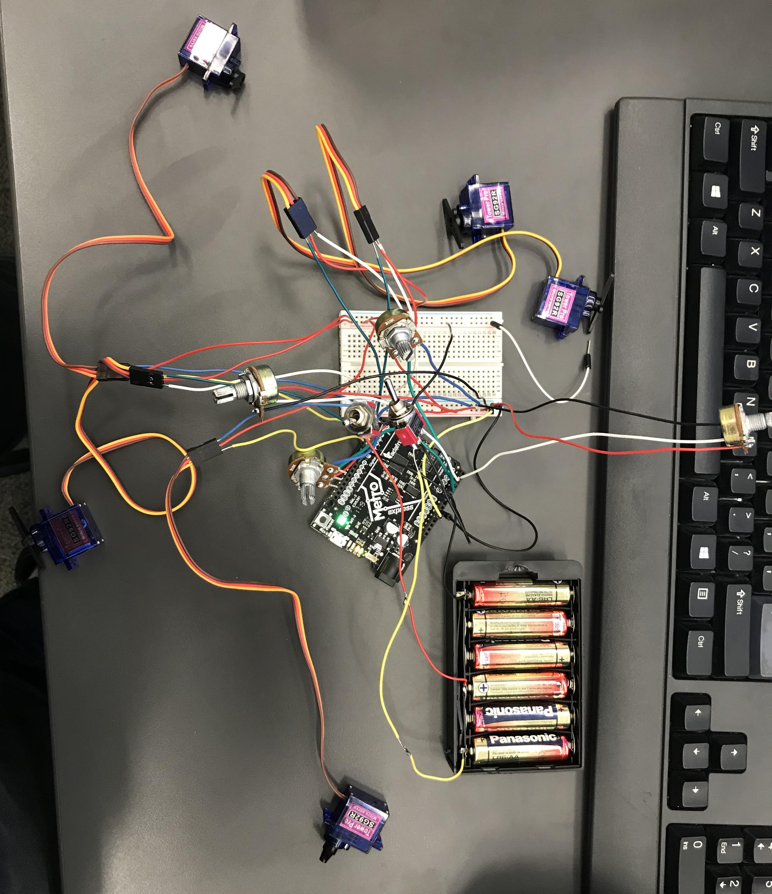
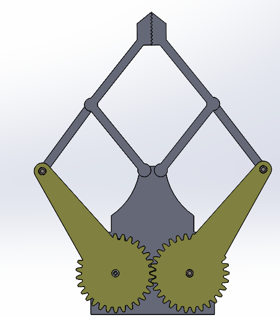
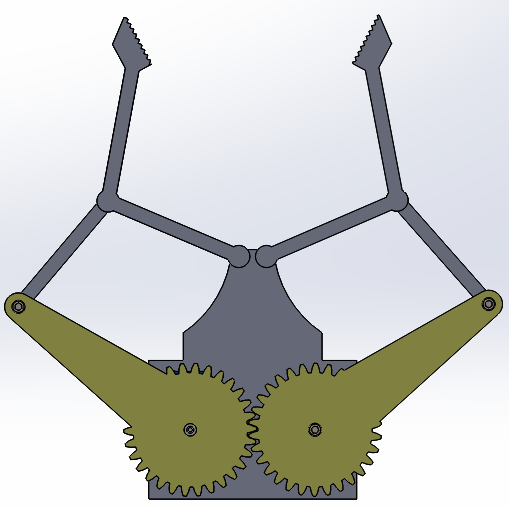
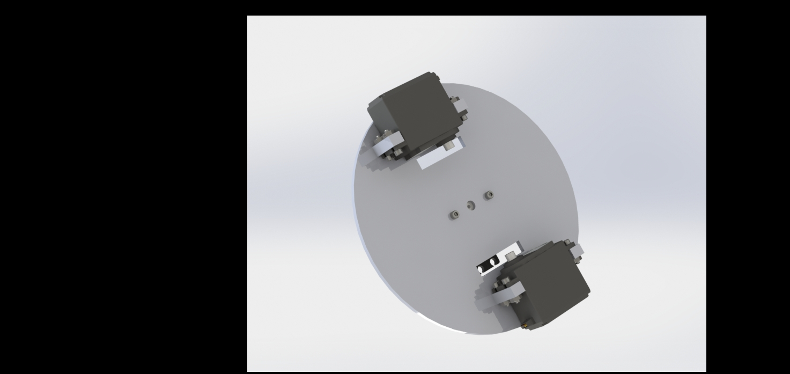
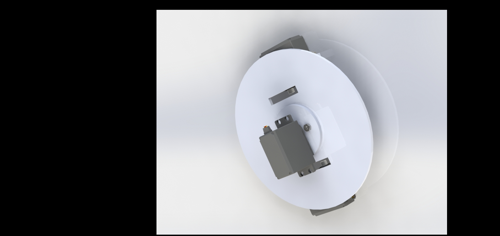
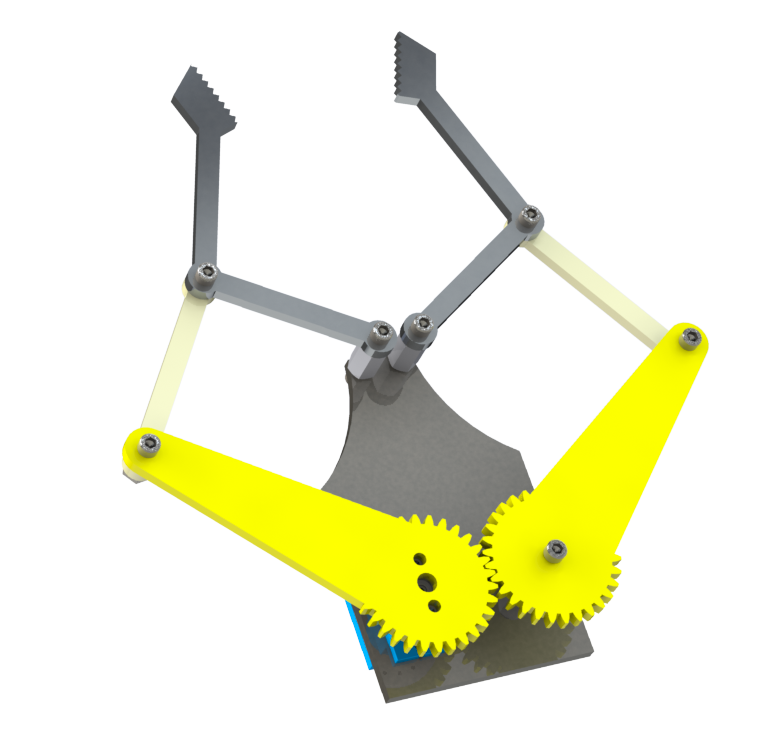

# Robot_Arm

## Robot Arm Weekly Documentation

### Week 1 (Jan 22 - 24) - *On Schedule*

* this week we finished up our planning
* we made a concrete description of what our claw and arm should look like
* Jude started on the code but didn't have much luck,
* Lukas started on the box and got 2 walls done.

### Week 2 (Jan 27 - 31) - *Ahead of Schedule*

* On monday, Jude figured how to map the potentiometer from 65536 to 180 so it can match up with the 180° Servos
* Lukas finished the box on wednesday, and made an assembly in SolidWorks
* On wednesday Jude got the first servo connected and working with the code
* Lukas started the Claw this week and is relatively far along

### Week 3 (Feb 3 - 7) - *Ahead of Schedule*

* Monday Jude got two of the servos working, he also switched the blue breadboard potentiometers for the real ones
* Lukas made good progress on the Claw on Monday, he got the gears working and started on the head of the Claw
* On Wednesday Jude finished all 5 servos and 4 potentiometers code and wiring, he also got the battery pack and connected it to the Metro
* On Wednesday Lukas made great progress on the claw, he finished every part except for how the servo will connect to it
* Thursday Jude is working on updating GitHub
* Lukas has almost finished the Claw and is preparing to do a motion study

    

### Week 4 (Feb 10 - 14) - *Ahead of Schedule*

* Monday Jude and Lukas rethought sizing of the box and arm
* On Wednesday Lukas resized box and started Resizing the arm to be a little smaller because compared to the box it was very large
* On Wednesday Jude started and finished the base on which the entire arm will turn, He added holders for servos also
* Thursday Lukas if finishing up the claw for good and Jude is working on GitHub documentation
* Friday Jude has made a few adjustments to the Base to make sure there are no problems with the servos
* Lukas had a minor setback as one of his mates made the motion study not work so he worked on that and figured it out and is doing the motion study

     

### Week 5 (Feb 17 - 21) - *Ahead of Schedule*

* Monday Jude and Lukas did a check in
* Wednesday Lukas started the Gear System
* Wednesday Jude made servo heads that were gears to turn with the Gear System
* Thursday Jude Started one part of the arm
* Thursday Lukas continued the Gear System
